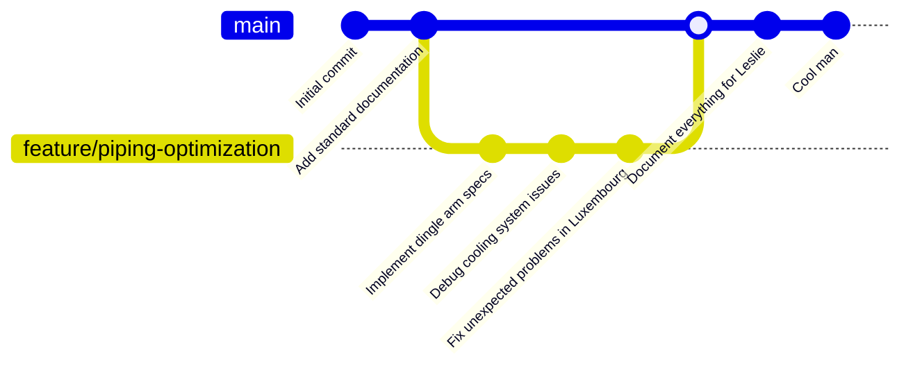

# bneidlinger

> "I'm a mid-level developer. For a company. That makes software."

## About Me 🔧

Just an industrial-grade software developer trying to navigate the complex world of... code. Some days involve writing functional code with AI. Other days involve being pushed off metaphorical buildings in Luxembourg. It's all part of the structural dynamics of flow.

- 🏗️ Currently working on: Donnely nut spacing and cracked system rim-riding grip configuration
- 🛠️ Specializing in: Double-reciprocating dingle arm development and implementation
- 📝 Documentation: When asked to present my solutions, sometimes I just sing about them
- 🎸 My debugging sessions are mostly in E minor. Very specific lyrics.
- 🌍 Based in: "Here. Sometimes there. Depends on the assignment."
- 🧠 Mental state: "Pretty good."

## Technical Expertise 📊

| Things I Know | Things I'm Learning | Things I've Done |
| :---: | :---: | :---: |
| Software Development | Brazilian Jiu-Jitsu | Retrograde System Testing |
| Structural Engineering | Mandarin | Coolant-line Code Optimization |
| Folk Music Composition | Classified Protocols | Centrifugal Force Error Handling |
| Parkour (unwillingly) | Self-Debugging Techniques | Reciprocating Dingle Arm Deployment |

## GitHub Stats 📈

View my completely normal development statistics

 

*Note: Any irregularities in commit patterns are due to international development conferences in Luxembourg, Paris, and Milwaukee.*

## Current Projects 🏗️

### 🔌 Donnely Nut Spacing System
A revolutionary approach to grip configuration and software architecture.
*"It's a complicated case... a lot of ins, a lot of outs, lot of what-have-yous."*

### 📊 Reciprocating Dingle Arm Framework
Comprehensive documentation for maintenance and troubleshooting procedures.
*"You really need to understand the structural dynamics of flow."*

### 🎵 Code Audit Logs (in E minor)
Extremely detailed logging and debugging system.
Sometimes with guitar accompaniment.
*"Very specific. Somewhat repetitive."*

## Performance Reviews 📋

<table>
  <tr>
    <td align="center">
       
      <b>Leslie Claret</b> 
      "His code has a cool head, but I'd like to see more of a pick-up in his documentation."
    </td>
    <td align="center">
       
      <b>Rick Sanchez</b> 
      "Of all the developers in the multiverse, your code is... *burp*... the least likely to cause a dimensional collapse."
    </td>
  </tr>
  <tr>
    <td align="center">
       
      <b>Tom Tavner</b> 
      "Satisfactory performance under difficult circumstances. The job gets done."
    </td>
    <td align="center">
       
      <b>Morty Smith</b> 
      "Ah geez, I don't really understand what your code does, but, um, it seems to work?"
    </td>
  </tr>
</table>

## Development Philosophy 💡

<kbd>
   
  "Sometimes engineering is more art than science. A lot of people don't get that."
</kbd>

## Project Contribution History 🗓️

```mermaid
gitGraph:
    commit id: "Initial commit"
    commit id: "Add standard documentation"
    branch "feature/piping-optimization"
    checkout "feature/piping-optimization"
    commit id: "Implement dingle arm specs"
    commit id: "Debug cooling system issues"
    commit id: "Fix unexpected problems in Luxembourg"
    checkout main
    merge "feature/piping-optimization"
    commit id: "Document everything for Leslie"
    commit id: "Cool man"
```

## The Lakeman Status Monitor 📉

## Contact Information 📫

- 📞 Phone: Available upon request. May change frequently for piping-related reasons.
- 📧 Email: Available upon request. Check before sending sensitive information.
- 🏢 Office: "I work at a... place. With computers."

## Development Tips 🔧

- Always carry a notebook for structural calculations
- Learn to talk about code with absolute conviction
- Develop a strong understanding of double-reciprocating systems
- If you have to present a technical solution, a song sometimes helps
- When asked how your project is going, "pretty good" works as an answer 94% of the time
- Remember: it's cool, man

---

  
  
  *"Pretty good."*
  
  ⭐ Star my repositories if you find their structural dynamics of flow appealing ⭐

<!-- 
  Note to self: Remember to update Luxembourg trip details.
  TODO: Figure out how to explain that missing week in Milwaukee.
  Reminder: Don't mention anything about "the other job" here.
-->
