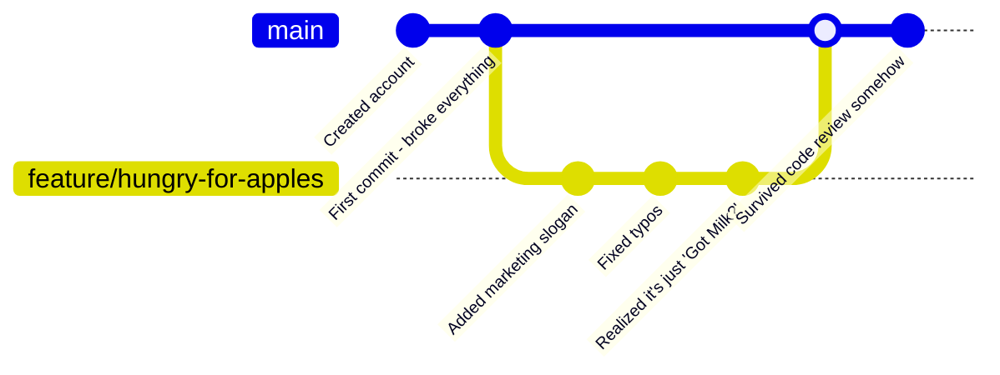

# Hello there! 👋

> "I love my GitHub contributions more than I love myself!"

## About Me 🛸

I'm just your average developer trying to find my place in this infinite universe of code. You know, not all of us can be Ricks, but someone has to be the Jerry! And you know what? That's perfectly fine!

- 🔭 Currently working on my latest app: "Hungry for Apples?" (It's not just a knockoff of "Got Milk?")
- 🌱 Learning how to survive a Cronenberg apocalypse... I mean, full-stack development
- 👨‍💼 Former employee at the month at Simplistic Algorithm Solutions
- 🏆 My greatest achievement? Surviving multiple interdimensional adventures!
- 🎯 Life goal: To have my code reviewed without someone saying "Ah, geez..."

## My Tech Arsenal ⚙️

| Things I Think I Know | Things I Definitely Don't Know | Things I Pretend To Know |
| :---: | :---: | :---: |
| HTML | Quantum Computing | Everything Rick Talks About |
| CSS | AI/ML | Portal Gun Physics |
| JavaScript (kinda) | Blockchain | How GitHub Actually Works |
| Making Toast | Dimensional Mathematics | What APIs Do |

## My GitHub Stats 📊

Click to unfold my probably disappointing stats

 

*Note: If these stats look impressive, there's a high chance an alternate dimension Jerry hacked my account.*

## Project Showcase 🏆

### 🍎 Hungry For Apples?
A revolutionary marketing campaign that is NOT just a ripoff of "Got Milk?" 
Built with pure determination and a complete lack of originality.

### 🎮 Roy: A Life Well Lived
A simulation of going from a carpet store to... back to the carpet store.
*"He's taking Roy off the grid! He doesn't have a social security number!"*

### 🧠 Plumbus Manufacturing Guide
Documentation on how they make a regular old Plumbus. Everybody has one!

## Testimonials 💬

<table>
  <tr>
    <td align="center">
       
      <b>Rick Sanchez</b> 
      "Of all the Jerrys in the multiverse, your code is... *burp*... the least disappointing."
    </td>
    <td align="center">
       
      <b>Beth Smith</b> 
      "I'm genuinely surprised this repository has stars."
    </td>
  </tr>
  <tr>
    <td align="center">
       
      <b>Morty Smith</b> 
      "Ah geez. Your code is, um, definitely something..."
    </td>
    <td align="center">
       
      <b>Summer Smith</b> 
      "Nobody is going to star your repository."
    </td>
  </tr>
</table>

## My Interdimensional Contributions 🌌

```mermaid
gitGraph:
    commit id: "Created account"
    commit id: "First commit - broke everything"
    branch "feature/hungry-for-apples"
    checkout "feature/hungry-for-apples"
    commit id: "Added marketing slogan"
    commit id: "Fixed typos"
    commit id: "Realized it's just 'Got Milk?'"
    checkout main
    merge "feature/hungry-for-apples"
    commit id: "Survived code review somehow"
```

## The Jerry Danger Meter 🔥

## Jerry's Development Philosophy 💭

<kbd>
  
   
  "Sometimes science is more art than science. A lot of people don't get that."
</kbd>

## How to Reach Me 📫

The best way to reach me is to scream into the void... or try these:

- 📧 Email: brandon.neidlinger@gmail.com

## Jerry Life Pro Tips 💡

- Always keep your interdimensional cable subscription updated
- Never visit Blips and Chitz without enough money for Roy 2
- Calibrate your Meseeks Box before making wishes
- Check if your Morty is actually your Morty and not some other dimension's Morty
- Don't trust any version of yourself from another dimension

---

  
  
  *"Grass... tastes bad!"*
  
  ⭐ Don't forget to star this repo if you're as desperate for validation as I am! ⭐

<!-- 
  Jerry Note to Self: Ask Beth if this README makes me look cool enough.
  Reminder: Definitely DO NOT mention the time I got fired for the "Hungry for Apples" campaign.
  TODO: Figure out what GitHub actually does.
-->
