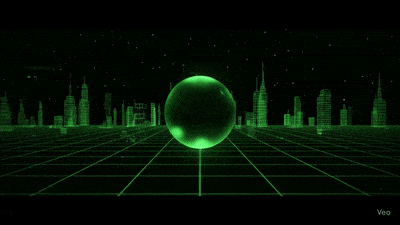

<div align="center">
  
</div>

```ascii
╔═══════════════════════════════════════════════════════════════════╗
║  TANGNET: DISTRIBUTED AI MESH NETWORK & EDGE COMPUTE LABORATORY   ║
╚═══════════════════════════════════════════════════════════════════╝
```

<div align="center">


</div>

> Building a retro-futuristic mesh of Raspberry Pis, desktop GPUs, and AI agents...  
> Because Moore's Law is more of a suggestion anyway.

## Current Tech Stack & Active Deployments

### Tangnet: Distributed AI Mesh Architecture
**Infrastructure Topology:**

<details>
<summary>🟢 LIVE NODE STATUS [CLICK TO EXPAND]</summary>

| Node | Hardware | Status | Load | Temp | Model | Uptime |
|------|----------|--------|------|------|-------|--------|
| **Alpha** 🖥️ | RTX 3070 Ti / 64GB | 🟢 ONLINE | █████░░░░░ 52% | 🌡️ 67°C | Llama2-70B | 42d 3h |
| **Beta** 💻 | RTX 4060 / 32GB | 🟢 ONLINE | ███░░░░░░░ 31% | 🌡️ 54°C | Mixtral-8x7B | 18d 7h |
| **Gamma** 🥧 | RPi5 16GB / Hailo-8 | 🟢 ONLINE | ████████░░ 78% | 🌡️ 72°C | TinyLlama-1.1B | 9d 14h |
| **Delta** 🔧 | RPi5 8GB / GPIO | 🟡 MAINTENANCE | ░░░░░░░░░░ 0% | 🌡️ 45°C | - | REBOOT |

</details>

```
┌─────────────────────────────────────────────────────────────┐
│ Node Alpha:   RTX 3070 Ti | 64GB DDR4 | Primary Inference   │
│ Node Beta:    RTX 4060    | 32GB LPDDR5 | Mobile Compute    │
│ Node Gamma:   RPi5 16GB   | Hailo-8 NPU | Edge Processing   │
│ Node Delta:   RPi5 8GB    | GPIO Array | Automation Control │
└─────────────────────────────────────────────────────────────┘
```

**Current Capabilities:**
- Self-hosted LLaMA.cpp instances (7B-70B parameter models)
- Custom WebSocket mesh protocol for inter-node communication
- Real-time dashboards via Grafana + Prometheus
- Markdown-based knowledge graphs with D3.js visualizations

### AI-Powered Retro Game Infrastructure
**Tech Implementation:**
- Backend: FastAPI + WebSocket game state synchronization
- AI: Custom fine-tuned models for NPC behavior
- Frontend: Pure SVG + vanilla JS (because frameworks are bloat)
- Monetization: Ko-fi webhooks → Stripe → custom licensing server

### Quantum-Inspired Market Simulation Engine
```python
# Each node maintains unique investor personality matrix
investor_profiles = {
    'node_alpha': {'risk_tolerance': 0.8, 'strategy': 'momentum'},
    'node_beta': {'risk_tolerance': 0.3, 'strategy': 'value'},
    # ... distributed consensus via custom RAFT implementation
}
```

## 🎮 Tangnet Command Center

<details>
<summary>⚡ QUICK ACCESS TERMINAL [EXPAND]</summary>

```bash
# Connect to Nodes
ssh tangnet@alpha    # Primary GPU inference node
ssh tangnet@beta     # Mobile compute unit
ssh pi@gamma         # Edge AI processor
ssh pi@delta         # GPIO automation hub

# Quick AI Queries
alias asktiny="curl -X POST http://gamma:8000/chat -d '{\"prompt\":\"...\"}''"
alias ask7b="curl -X POST http://alpha:8000/chat -d '{\"prompt\":\"...\"}''"

# System Monitoring
watch -n 1 'tangnet-status --all'              # Live node status
tail -f /var/log/tangnet/mesh.log             # Mesh network logs
nvidia-smi dmon -s pucvmet -d 1               # GPU monitoring

# Emergency Procedures
tangnet-shutdown --node=all --graceful        # Controlled shutdown
tangnet-failover --primary=beta               # Promote Beta to primary
sudo systemctl restart tangnet-mesh            # Restart mesh service
```

</details>

## Core Technologies & Proficiencies

| Layer | Technologies | Status |
|-------|-------------|---------|
| **Languages** | `Python 3.11+`, `Bash`, `PowerShell Core 7+`, `C++ (Arduino)` | Production |
| **AI/ML** | `llama.cpp`, `GGUF`, `MLC-LLM`, `TensorRT`, `ONNX` | Active |
| **Hardware** | `Raspberry Pi GPIO`, `Arduino Mega 2560`, `ESP32-WROOM` | Deployed |
| **Cloud** | `AWS (S3, EC2, Bedrock, Lambda)`, `Azure (planned)`, `Cloudflare Workers` | Scaling |
| **Frontend** | `HTML5`, `SVG 2.0`, `TailwindCSS v3`, `Vanilla JS ES2023` | No React Required™ |

## Current Learning Vectors
- [ ] Kubernetes at the edge (K3s on ARM64)
- [ ] Custom ASIC design for neural inference
- [ ] Home Assistant → Tangnet bidirectional integration
- [ ] WebRTC P2P for zero-latency game state sync

---

## Peer Review Matrix

<table>
<tr>
<td align="center" width="50%">


**"This man put a Raspberry Pi on a Roomba and called it a data center."**  
*— Anonymous SRE, probably*

</td>
<td align="center" width="50%">


**"He's calculating FLOPS on a toaster. I don't know if I should be impressed or concerned."**  
*— Senior DevOps Engineer*

</td>
</tr>
<tr>
<td align="center" width="50%">


**"It's giving Skynet, but with charm and RGB LEDs."**  
*— My Wife (backing away slowly)*

</td>
<td align="center" width="50%">


**"The thermal management is... let's call it 'organic'. Fire extinguisher is in the lab."**  
*— Facilities Manager*

</td>
</tr>
</table>

---

## Network Endpoints & Contact Vectors

```yaml
primary_contact:
  email: brandon.neidlinger@gmail.com
  location: Apple Valley, MN
  availability: "24/7 (sleep is for single-threaded systems)"
  
social_protocols:
  github: "Check my repos for the chaos"
  linkedin: "For corporate cosplay only"
  twitter: "404 - Sanity Not Found"
```

---

<div align="center">

```
╔════════════════════════════════════════════════════════════════╗
║  "All of this was done in the name of curiosity, caffeine,     ║
║   and a fundamental misunderstanding of electrical safety."    ║
╚════════════════════════════════════════════════════════════════╝
```

**⚡ Currently Running:** `uptime: 42 days` | `coffee_consumed: 847 cups` | `magic_smoke_incidents: 3`

</div>
